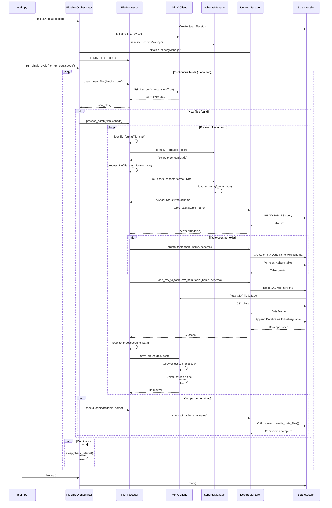
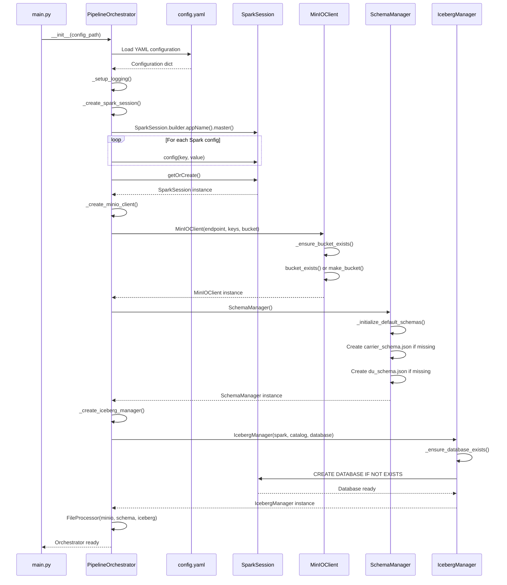
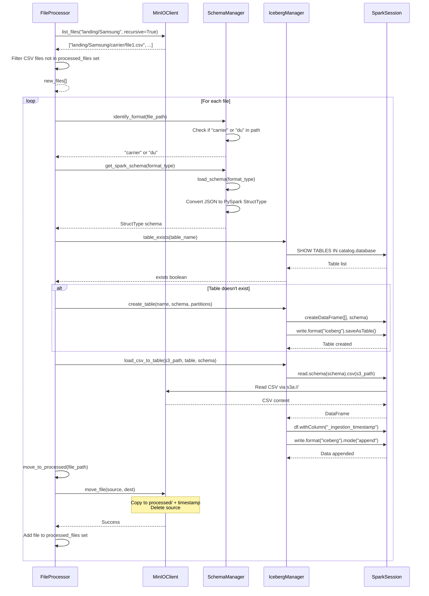
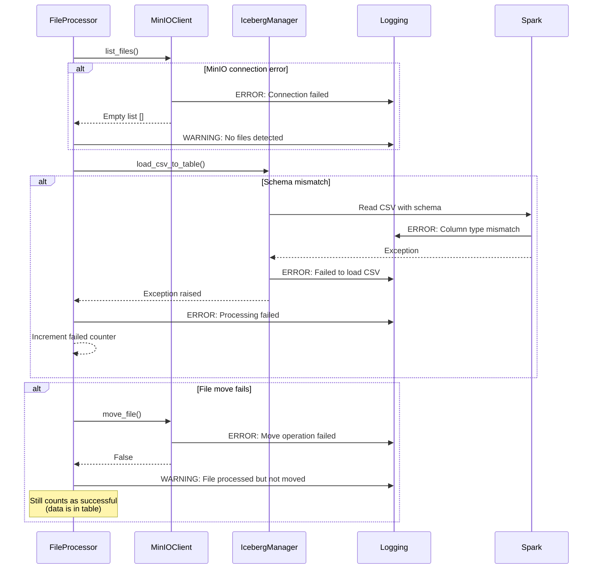

# Sequence Diagram - CSV to Iceberg Pipeline

This document contains sequence diagrams showing the flow of operations in the CSV to Iceberg pipeline.

## Main Processing Flow



## Initialization Sequence



## File Processing Detail



## Error Handling Flow



## Component Interactions Summary

| Component | Responsibilities | Key Methods |
|-----------|-----------------|-------------|
| **main.py** | Entry point, CLI argument parsing | `main()` |
| **PipelineOrchestrator** | Coordinates all components, manages lifecycle | `run_single_cycle()`, `run_continuous()`, `cleanup()` |
| **FileProcessor** | File detection, format identification, batch processing | `detect_new_files()`, `process_batch()`, `move_to_processed()` |
| **MinIOClient** | S3-compatible storage operations | `list_files()`, `move_file()`, `upload_file()`, `download_file()` |
| **SchemaManager** | Schema loading, validation, format identification | `load_schema()`, `get_spark_schema()`, `identify_format()` |
| **IcebergManager** | Iceberg table operations via Spark | `create_table()`, `append_data()`, `load_csv_to_table()`, `compact_table()` |
| **SparkSession** | Spark execution engine, SQL queries | Spark SQL operations, DataFrame operations |

## Data Flow

```
CSV Files (MinIO)
    ↓
File Detection (FileProcessor → MinIOClient)
    ↓
Format Identification (FileProcessor → SchemaManager)
    ↓
Schema Loading (FileProcessor → SchemaManager)
    ↓
Table Creation (if needed) (FileProcessor → IcebergManager → Spark)
    ↓
CSV Reading (IcebergManager → Spark → MinIO via s3a://)
    ↓
Data Transformation (Spark: add ingestion timestamp)
    ↓
Iceberg Table Append (IcebergManager → Spark)
    ↓
File Movement (FileProcessor → MinIOClient)
    ↓
Processed Files (MinIO)
```


